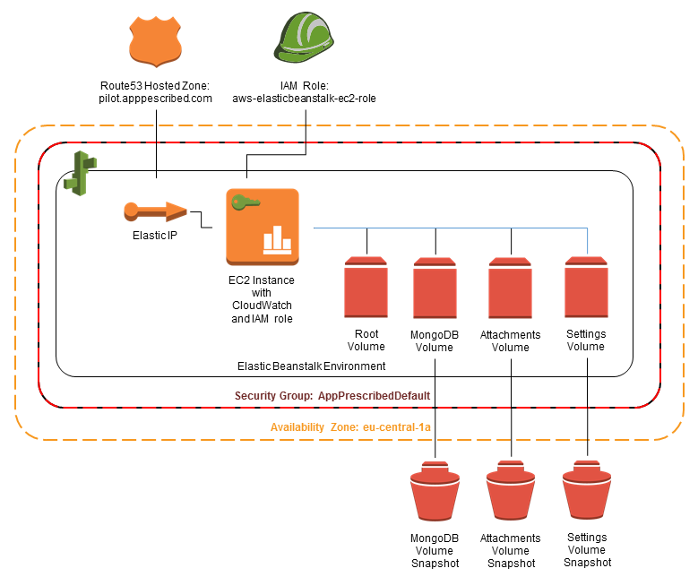

==============================================
AppPrescribed Pilot AWS Solution Documentation
==============================================

Contents
========
- `1.0 Introduction`_

  - `1.1 In Scope`_
  - `1.2 Out of Scope`_

- `2.0 Solution Overview`_

  - `2.1 File Listing`_

- `3.0 Usage`_

  - `3.1 Environment Deployment`_
  - `3.2 Environment Rebuild or Termination`_
  - `3.3 Code Updates`_

1.0 Introduction
================
AppPescribed is a Node.js-based web application developed by F. Hoffman-La Roche AG (Roche) in Switzerland.
The purpose of the code in this repository is to enable Roche to deploy a pre-release version of AppPescribed onto Amazon Web Services (AWS) for testing and demonstration purposes. The project to develop this code lasted approximately two weeks, with the goal of rapidly providing a low cost, non-redundant deployment of AppPescribed.

1.1 In Scope
------------
- The application shall be accessible over the public internet at www.pilot.apppescribed.com.
- The solution shall utilise the Elastic Beanstalk Platform-as-a-Service (PaaS) solution.
- The solution shall provide a means of monitoring memory utilisation of any EC2 instances running the application.
- All code and documentation produced shall be made available to Roche via a public GitHub repository.

1.2 Out of Scope
----------------
- Support for multiple concurrent installations (sub-domains) of the application. 
- High availability of the application.
- High availability of any data stored within the application.
- Backups of any data stored within the application.
- Full automation of all aspects of the solution.
- Security hardening of the solution.
- Ongoing support of the solution.

2.0 Solution Overview
=====================
The solution deploys the application into an Elastic Beanstalk Node.js environment. The application code runs on an EC2 instance managed by Elastic Beanstalk, with data for MongoDB and the application's "attachments" directory stored on separate EBS volumes automatically generated from pre-configured snapshots.

The EC2 instance is secured using a pre-configured security group and an IAM role. The security group is set up to allow direct access to the applications own ports when needed, and the IAM role allows the EC2 instance to publish new metrics to CloudWatch. This is used to enable monitoring of memory utilisation within the EC2 instance via the CloudWatch service.

A Route53 hosted zone of "pilot.appprescribed.com" is used for all DNS records, with the following A records being configured to point to the Elastic IP of the Elastic Beanstalk environment:

- www.pilot.appprescribed.com
- admin.pilot.appprescribed.com
- mobile.pilot.appprescribed.com
- evisit.pilot.appprescribed.com
- api.pilot.appprescribed.com

Nginx is configured on the EC2 instance to act as a reverse proxy for the application. For each A records listed above a virtual host exists in Nginx which maps that host name to the correct port on the Node.js server.

The solution is configured to run EC2 instances and EBS volumes in a single availability zone, specifically eu-central-1a. The eu-central-1 region was selected due to it's physical proximity to the expected pilot user base, which is planned to be predominantly in Europe.

The following diagram shows an overview of the major components of the solution:

2.1 File Listing
----------------
- **.ebextensions** contains Elastic Beanstalk customisation files for including in the application zip file/tarball.

  - **000-beanstalk-options.config** sets general Elastic Beanstalk environment options.
  - **001-mongo-repo.config** installs an additional yum repository containing a version of MongoDB complied to work on Amazon Linux.
  - **002-packages.config** installs all additional packages needed for the application to run.
  - **003-files.config** writes configuration and script files required before the application is installed.
  - **004-mount-ebs.config** creates and attaches EBS volumes for MongoDB and user-uploaded files and updates /etc/fstab.
  - **005-services.config** configures MongoDB to run and both MongoDB and Nginx to restart if their configuration is updated and configures the firewall.
  - **006-monitoring.config** installs and configures the Amazon CloudWatch Monitoring Scripts for Linux.

- **config** contains sample configuration files which are deployed into the Elastic Beanstalk environment.

  - **admin.js** configures the initial administer account in the application.
  - **authorized_keys** the public SSH keys to be granted access to the application's EC2 instances
  - **config.json** configures all general options in the application.
  - **pilot.appprescribed.com.conf** configures Nginx to act as a reverse proxy for the application's various interfaces.

- **scripts** contains script files for deploying the application.

  - **15_umount_attachments.sh** is intended to be run inside an Elastic Beanstalk environment and unmounts the attachments EBS volume during the deployment of new version of the application.
  - **99_app_setup.sh** is intended to be run inside an Elastic Beanstalk environment and performs the final configuration steps prior to the application being started.
  - **ami-setup.sh** performs a scripted installation of the application intended to be run manually in a non-Elastic Beanstalk EC2 instance.

3.0 Usage
=========
This section provides a short overview of how the code in this repository should be used for some common operational activities. These directions are intended to be used in conjunction with AWS documentation.

3.1 Environment Deployment
--------------------------
..note::
  AWS documentation for launching a new Elastic Beanstalk environment can be found here: http://docs.aws.amazon.com/elasticbeanstalk/latest/dg/using-features.environments.html

When launching a new Elastic Beanstalk environment the zip file containing the application code must be structured correctly. This means that;
- The directory containing package.json should be the root of the zip file.
- The .ebextensions directory from this repository should be included in the root of the zip file.

Although the .ebextensions files will perform most of the configuration of the environment, the AWS console will ask for several options to be selected. When asked, select the following options:

#. Web Server Environment: aws-elasticbeanstalk-ec2-role
#. Predefined configuration: Node.js
#. Environment type: Single instance
#. Application Version: Either select and existing version of the zip file or upload a new one as required
#. Environment name & URL: a value of "appPescribed-" followed by the purpose of the environment (e.g. "qa", "prod", etc.) is recommended
#. Additional Resources: leave all boxers unticked

All other options can be left as default.

3.2 Environment Rebuild or Termination
--------------------------------------
..note::
  AWS documentation for terminating a Elastic Beanstalk environment can be found here: http://docs.aws.amazon.com/elasticbeanstalk/latest/dg/using-features.terminating.html

Both rebuilding and terminating an environment are destructive operations, and as such any data stored by the application running in that environment **will be lost** when performing these operations.
Application data which may need to be retained after these operations, specifically the MongoDB database and the "attachments" directory, are set up to be stored on EBS volumes to enable this data to be retained if required.
If the data must be retained this can be accomplished by taking snapshots of the EBS volumes in AWS. The EBS volumes associated with the environment can be identified by examining the "Attachement Information" column in the EBS console.
A full description of the process for snapshotting an EBS volume can be found in the AWS documentation here: http://docs.aws.amazon.com/AWSEC2/latest/UserGuide/ebs-creating-snapshot.html

3.3 Code Updates
----------------
..note::
  AWS documentation for updating a Elastic Beanstalk environment can be found here: http://docs.aws.amazon.com/elasticbeanstalk/latest/dg/using-features.deploy-existing-version.html

When updating an existing environment with a new version of the application code, the zip file must be structured correctly as described in section `3.1 Environment Deployment`_
